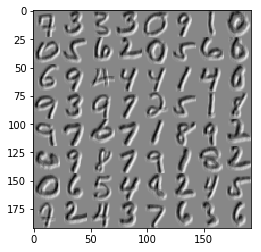

Prepare enviroment and data 


```python
from pylab import *
%matplotlib inline
caffe_root = './'  # this file should be run from {caffe_root} (otherwise change this line)
import sys
sys.path.insert(0, caffe_root + 'python')
import caffe
import os
# Download data
!data/mnist/get_mnist.sh
# Prepare data
!examples/mnist/create_mnist.sh
```

    Downloading...
    Creating lmdb...
    I0521 15:35:20.211447  3173 db_lmdb.cpp:35] Opened lmdb examples/mnist/mnist_train_lmdb
    I0521 15:35:20.211688  3173 convert_mnist_data.cpp:88] A total of 60000 items.
    I0521 15:35:20.211719  3173 convert_mnist_data.cpp:89] Rows: 28 Cols: 28
    I0521 15:35:20.548806  3173 convert_mnist_data.cpp:108] Processed 60000 files.
    I0521 15:35:22.215997  3177 db_lmdb.cpp:35] Opened lmdb examples/mnist/mnist_test_lmdb
    I0521 15:35:22.216298  3177 convert_mnist_data.cpp:88] A total of 10000 items.
    I0521 15:35:22.216311  3177 convert_mnist_data.cpp:89] Rows: 28 Cols: 28
    I0521 15:35:22.268962  3177 convert_mnist_data.cpp:108] Processed 10000 files.
    Done.


Creating the net


```python
from caffe import layers as L, params as P
def lenet(lmdb, batch_size):
    # our version of LeNet: a series of linear and simple nonlinear transformations
    n = caffe.NetSpec()
    n.data, n.label = L.Data(batch_size=batch_size, backend=P.Data.LMDB, source=lmdb,
                             transform_param=dict(scale=1./255), ntop=2)
    n.conv1 = L.Convolution(n.data, kernel_size=5, num_output=20, weight_filler=dict(type='xavier'),
                           weights_compress=["ULQ","ULQ"], #compress methods for kernel and bias
                           weights_compress_param=[{"maxbits":2},{"maxbits":2}], #compress param for kernel and bias
                           activations_compress="Clip",#compress method for activations
                           activations_compress_param={"maxbits":8})#compress param for activations
    n.pool1 = L.Pooling(n.conv1, kernel_size=2, stride=2, pool=P.Pooling.MAX)
    n.conv2 = L.Convolution(n.pool1, kernel_size=5, num_output=50, weight_filler=dict(type='xavier'),
                           weights_compress=["ULQ","ULQ"],
                           weights_compress_param=[{"maxbits":2},{"maxbits":2}],
                           activations_compress="Clip",
                           activations_compress_param={"maxbits":8})
    n.pool2 = L.Pooling(n.conv2, kernel_size=2, stride=2, pool=P.Pooling.MAX)
    n.fc1 =   L.InnerProduct(n.pool2, num_output=500, weight_filler=dict(type='xavier'),
                            weights_compress=["ULQ","ULQ"],
                           weights_compress_param=[{"maxbits":2},{"maxbits":2}],
                           activations_compress="Clip",
                           activations_compress_param={"maxbits":2})
    n.relu1 = L.ReLU(n.fc1, in_place=True)
    n.score = L.InnerProduct(n.relu1, num_output=10, weight_filler=dict(type='xavier'))
    n.loss =  L.SoftmaxWithLoss(n.score, n.label)
    return n.to_proto()
train_net_path=caffe_root+'examples/mnist/lenet_auto_quantization_train.prototxt'
test_net_path=caffe_root+'examples/mnist/lenet_auto_quantization_test.prototxt'
train_batchsize=64
train_epoch=floor(50000/train_batchsize)
test_batchsize=100
test_epoch=floor(10000/test_batchsize)
with open(train_net_path, 'w') as f:
    f.write(str(lenet(caffe_root+'examples/mnist/mnist_train_lmdb', train_batchsize)))
with open(test_net_path, 'w') as f:
    f.write(str(lenet(caffe_root+'examples/mnist/mnist_test_lmdb', test_batchsize)))
```


```python
solver_config_path=caffe_root+'examples/mnist/lenet_auto_quantization_solver.prototxt'
from caffe.proto import caffe_pb2
s = caffe_pb2.SolverParameter()
s.random_seed = 0xCAFFE
s.train_net = train_net_path
s.test_net.append(test_net_path)
s.test_interval = 500  # Test after every 500 training iterations.
s.test_iter.append(100) # Test on 100 batches each time we test.
s.max_iter = 10000     # no. of times to update the net (training iterations)
# EDIT HERE to try different solvers
# solver types include "SGD", "Adam", and "Nesterov" among others.
s.type = "SGD"
# Set the initial learning rate for SGD.
s.base_lr = 0.01  # EDIT HERE to try different learning rates
# Set momentum to accelerate learning by
# taking weighted average of current and previous updates.
s.momentum = 0.9
# Set weight decay to regularize and prevent overfitting
s.weight_decay = 5e-4
# Set `lr_policy` to define how the learning rate changes during training.
# This is the same policy as our default LeNet.
s.lr_policy = 'inv'
s.gamma = 0.0001
s.power = 0.75
# EDIT HERE to try the fixed rate (and compare with adaptive solvers)
# `fixed` is the simplest policy that keeps the learning rate constant.
# s.lr_policy = 'fixed'
# Display the current training loss and accuracy every 1000 iterations.
s.display = 1000
# Snapshots are files used to store networks we've trained.
# We'll snapshot every 5K iterations -- twice during training.
s.snapshot = 5000
s.snapshot_prefix = "lenet_auto_quantization"
# Train on the GPU
s.solver_mode = caffe_pb2.SolverParameter.GPU
# Write the solver to a temporary file and return its filename.
with open(solver_config_path, 'w') as f:
    f.write(str(s))
### load the solver and create train and test nets
caffe.set_device(3)#set your own gpu id
caffe.set_mode_gpu()
solver = None  # ignore this workaround for lmdb data (can't instantiate two solvers on the same data)
solver = caffe.get_solver(solver_config_path)
```

# Training


```python
epoches = 20
# print train_epoch
# losses will also be stored in the log
train_loss = zeros(epoches)
test_acc = zeros(epoches)
# the main solver loop
for ep in range(epoches):
    solver.step(int(train_epoch))  # run one epoch
    # store the train loss
    train_loss[ep] = solver.net.blobs['loss'].data
    correct = 0
    for test_it in range(100):
        solver.test_nets[0].forward()
        correct += sum(solver.test_nets[0].blobs['score'].data.argmax(1)== solver.test_nets[0].blobs['label'].data)
    test_acc[ep] = correct / 1e4
    print("epoch %d: train loss=%.4f, test accuracy=%.4f"%(ep,train_loss[ep],test_acc[ep]))
#plot figure
_, ax1 = subplots()
ax2 = ax1.twinx()
ax1.plot(arange(epoches), train_loss)
ax2.plot(arange(epoches), test_acc, 'r')
ax1.set_xlabel('iteration')
ax1.set_ylabel('train loss')
ax2.set_ylabel('test accuracy')
ax2.set_title('Test Accuracy: {:.2f}'.format(test_acc[-1]))
```

    epoch 0: train loss=0.0722, test accuracy=0.9736
    epoch 1: train loss=0.0528, test accuracy=0.9797
    epoch 2: train loss=0.0113, test accuracy=0.9833
    epoch 3: train loss=0.0100, test accuracy=0.9868
    epoch 4: train loss=0.0012, test accuracy=0.9882
    epoch 5: train loss=0.0006, test accuracy=0.9865
    epoch 6: train loss=0.0047, test accuracy=0.9894
    epoch 7: train loss=0.0160, test accuracy=0.9896
    epoch 8: train loss=0.0043, test accuracy=0.9886
    epoch 9: train loss=0.0090, test accuracy=0.9905
    epoch 10: train loss=0.0050, test accuracy=0.9887
    epoch 11: train loss=0.0014, test accuracy=0.9894
    epoch 12: train loss=0.0059, test accuracy=0.9896
    epoch 13: train loss=0.0100, test accuracy=0.9911
    epoch 14: train loss=0.0106, test accuracy=0.9902
    epoch 15: train loss=0.0028, test accuracy=0.9904
    epoch 16: train loss=0.0013, test accuracy=0.9889
    epoch 17: train loss=0.0095, test accuracy=0.9904
    epoch 18: train loss=0.0032, test accuracy=0.9903
    epoch 19: train loss=0.0071, test accuracy=0.9908


    Text(0.5,1,'Test Accuracy: 0.99')


```python
#restore the weights to integer
def parse_data(data,compress_method,compress_param):
    if compress_method=="ULQ":
        alpha=compress_param.alpha
        beta=compress_param.delta
        return (data-beta)/alpha+0.5
    if compress_method=="Ternary_Quantize":
        alpha=compress_param.alpha
        fixedpos=compress_param.fixedpos
        print("restore alpha to integer: alpha=%f"%(alpha/2**fixedpos))
        return data/alpha
    if compress_method=="Clip":
        alpha=compress_param.alpha
        return data/alpha  
layer=solver.net.layers[1]
#for ULQ
data1=parse_data(layer.blobs[0].quantize,layer.weights_compress[0],layer.weights_compress_param[0])
#for Ternary_Quantization
data2=parse_data(layer.blobs[1].quantize,layer.weights_compress[1],layer.weights_compress_param[1])
#for Clip
data3=parse_data(solver.net.blobs['conv1'].data,layer.activations_compress[0],layer.activations_compress_param[0])
print(data1.reshape(-1)[:5])
print(data2.reshape(-1)[:5])
print(data3.reshape(-1)[:5])
imshow(data3[:,0].reshape(8, 8, 24, 24).transpose(0, 2, 1, 3).reshape(8*24, 8*24), cmap='gray')
```

    [ 0.99999994  0.99999994  0.99999994  0.          0.99999994]
    [  1.00000000e+00  -5.96046448e-08  -1.00000000e+00   2.00000000e+00
       2.00000000e+00]
    [ 0.  0.  0.  0.  0.]




